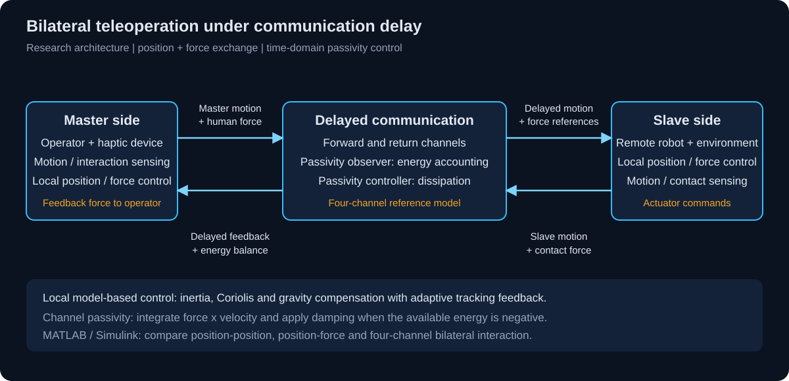
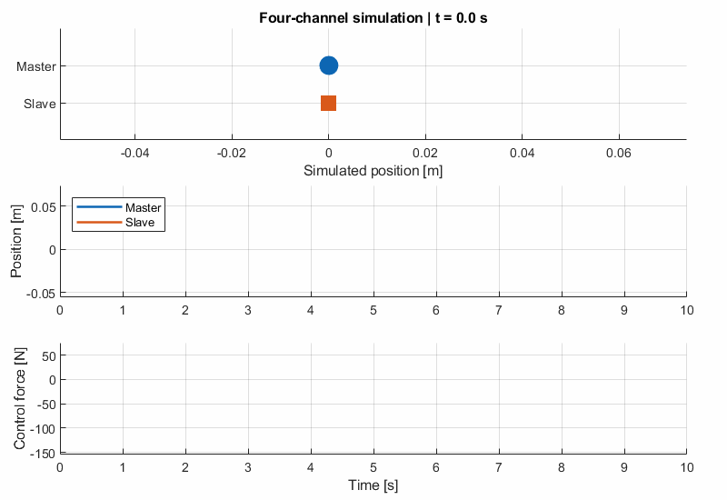
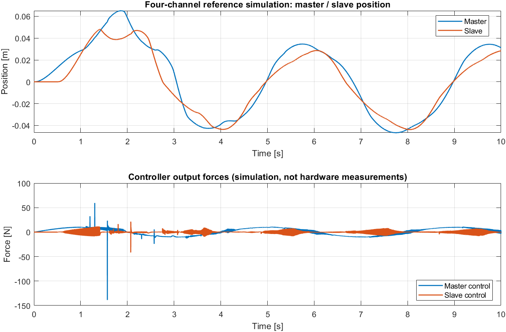

# Bilateral Teleoperation

**MATLAB/Simulink simulation and hardware controller design by Luca Obwegs,
developed during a 2023 exchange semester in Prof. Jee-Hwan Ryu's laboratory
at KAIST.**

The project combines model-based robot control with delayed bilateral
teleoperation: the operator moves a Phantom master device, a remote
three-joint robot follows the motion, and interaction forces are returned to
the operator. The central challenge is to preserve useful position and force
feedback when communication delay changes the energy of the coupled system.



[Watch the hardware experiment](https://lucaobwegs.com/phantom-robot-bilateral-teleoperation-control/)

## Where to find the controller logic

The diagram above separates local robot control from the delayed communication
channel's passivity observer and controller. For the implemented simulation
logic, start with
[`simulation/models/FourCh_TDPA_TD.slx`](simulation/models/FourCh_TDPA_TD.slx):
follow the motion/force channels and their time-domain passivity elements.
The alternative couplings are in
[`PP_TDPA_TD.slx`](simulation/models/PP_TDPA_TD.slx) and
[`PFmsr_TDPA_TD.slx`](simulation/models/PFmsr_TDPA_TD.slx).

For my hardware controller design, see
[`docs/hardware.md`](docs/hardware.md), which explains the parallel
force/position, adaptive inverse-dynamics and impedance equations.
The published implementation is MATLAB/Simulink; the hardware controller is
documented mathematically, and this repository does not contain a C++ device
controller.

## MATLAB / Simulink simulation



*Master/slave motion schematic and time histories generated from the
four-channel Simulink model. The markers show the simulated scalar positions,
not the articulated geometry of the hardware.*

I compared three bilateral architectures:

| Model | Control concept |
|---|---|
| `PP_TDPA_TD.slx` | Position-position coupling: each side follows motion received from the other side |
| `PFmsr_TDPA_TD.slx` | Position-force coupling: master motion commands the slave, and measured force is reflected to the operator |
| `FourCh_TDPA_TD.slx` | Four-channel coupling: position/motion and force information are exchanged in both directions |

The models combine local master/slave dynamics, communication channels and
time-domain passivity elements. A delayed signal is represented by

$$x_{m\rightarrow s}(t)=x_m(t-T_{ms}),\qquad
f_{s\rightarrow m}(t)=f_s(t-T_{sm}).$$

Here $T_{ms}$ and $T_{sm}$ are the forward and return delays. Their values and
the enabled passivity elements are configured within each model.

For position coupling, a useful interpretation of the local command is a
virtual spring-damper between the slave and the received master reference:

$$f_{s,\mathrm{pos}} =
K_x(x_{m\rightarrow s}-x_s)
+D_x(\dot x_{m\rightarrow s}-\dot x_s).$$

Force feedback returns the remote interaction to the master. In four-channel
control, both sides additionally exchange their motion and force information;
local dynamics compensation and the channel corrections form separate parts
of the controller.

### Time-domain passivity

Delay can cause the communication channel to deliver more energy than it has
received. Rather than treating delay only as a tracking error, I used
passivity observers to account for the energy exchanged at the interaction
ports, and passivity controllers to add dissipation when an energy deficit
appears.

For force $f$ and velocity $v$, with positive power defined into the observed
port,

$$p[k]=f[k]^\mathsf{T}v[k],\qquad
E[k]=E[k-1]+\Delta t\,p[k].$$

Channel accounting combines received, delivered and previously dissipated
energy. If the available balance $W[k]$ becomes negative, a scalar
damping correction can remove the deficit:

$$\alpha[k]=
\begin{cases}
\dfrac{-W[k]}{\Delta t\,v[k]^2},&W[k]<0,\quad |v[k]|>\varepsilon,\\
0,&\text{otherwise},
\end{cases}
\qquad f_{\mathrm{PC}}[k]=-\alpha[k]v[k].$$

The dissipated energy is $\Delta t\,\alpha[k]v[k]^2$. Near zero velocity,
division requires a velocity threshold; energy accounting continues until
motion permits a dissipative correction. The force sign at each master/slave
port follows its chosen coordinate convention.



*Simulated master/slave positions and local controller forces. The early force
transients show why interaction dynamics and energy exchange matter alongside
position tracking.*

## Robot model and hardware controller

My hardware work combined parallel force/position teleoperation with an
adaptive inverse-dynamics controller. I also explored impedance,
Slotine-Li adaptive and sliding-mode control. The controller derivation and
the role of these alternatives are described in
[Hardware controller design](docs/hardware.md); that document presents the
design mathematically rather than as device firmware.

### Kinematics and rigid-body dynamics

I built a symbolic three-joint model from link geometry, CAD-derived masses,
centres of mass and inertia tensors. Homogeneous transforms give link and
end-effector positions. The position Jacobian connects joint motion to
Cartesian motion:

$$x=h(q),\qquad J(q)=\frac{\partial h}{\partial q},\qquad
\dot x=J(q)\dot q,\qquad
\ddot x=J(q)\ddot q+\dot J(q,\dot q)\dot q.$$

The rigid-body equation is

$$M(q)\ddot q+C(q,\dot q)\dot q+G(q)=\tau.$$

The inertia matrix collects translational and rotational kinetic energy:

$$M(q)=\sum_i
\left(m_iJ_{v,i}^\mathsf{T}J_{v,i}
+J_{\omega,i}^\mathsf{T}R_iI_iR_i^\mathsf{T}J_{\omega,i}\right).$$

The Coriolis matrix is obtained from Christoffel terms, and the gravity term
from the model's potential-energy expression. This separates the nonlinear
robot dynamics from the desired tracking behaviour.

### Inverse-dynamics tracking

With $e=q_d-q$ and $\dot e=\dot q_d-\dot q$, the commanded torque is

$$\tau=M(q)\left(\ddot q_d+K_d\dot e+K_pe\right)
+C(q,\dot q)\dot q+G(q).$$

With exact compensation, the joint error follows

$$\ddot e+K_d\dot e+K_pe=0.$$

The MATLAB tracking example uses $K_p=16I$, $K_d=8I$ and a smooth reference

$$q_d(t)=0.15(1-\cos(0.5t))
\begin{bmatrix}1&-0.5&0.25\end{bmatrix}^{\mathsf T}.$$

This illustrates how the symbolic model supplies the torque calculation.
The hardware controller extends this model-based idea with adaptation and
interaction feedback, while channel passivity addresses delayed energy
exchange.

More derivation, including task-space control and adaptive parameter
updates: [Control design](docs/control-design.md).

## Explore the simulation

```matlab
addpath(fullfile(pwd, 'simulation'));
out = run_model("FourCh_TDPA_TD", 10);
export_results;
export_animation;

addpath(fullfile(pwd, 'simulation', 'dynamics'));
result = run_robot_simulation(5);
plot(result.time, result.state(:,1:3));
xlabel('Time [s]'); ylabel('Joint angle [rad]');
```

The simulation uses MATLAB/Simulink; symbolic dynamics use Symbolic Math
Toolbox. Joint angles are radians. The symbolic derivation uses mm,
kg and kg mm^2; its generalized torques convert to N m with a factor of
$10^{-6}$. Inverse kinematics takes Cartesian positions in metres.

## Project files

```text
simulation/models/   Three bilateral Simulink architectures
simulation/dynamics/ Symbolic kinematics, rigid-body dynamics and tracking
simulation/          Model runner, plot and animation generation
docs/                Control equations, hardware design and simulation visuals
```

## References

- Artigas Esclusa, J. (2014). *Time domain passivity control for delayed
  teleoperation*. [DLR thesis record](https://elib.dlr.de/113216/)
- Farkhatdinov, I., & Ryu, J.-H. (2007). Hybrid position-position and
  position-speed command strategy for bilateral teleoperation of a mobile
  robot. [DOI: 10.1109/ICCAS.2007.4406773](https://doi.org/10.1109/ICCAS.2007.4406773)
